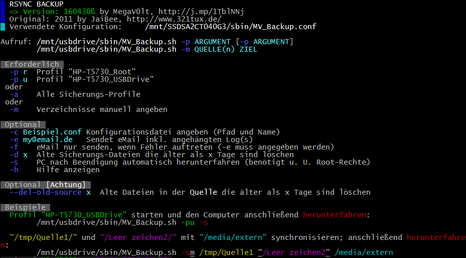
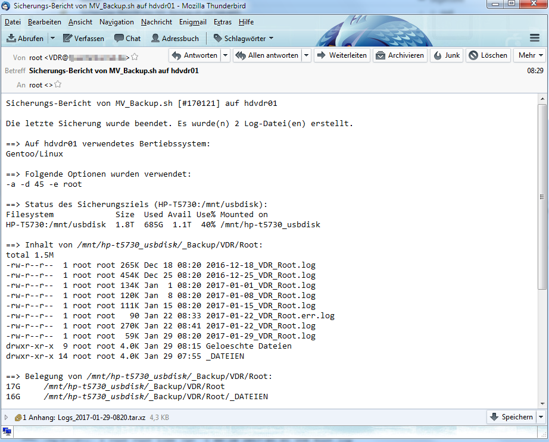

# MV_Backup
RSYNC Backup Skript

Ein Backup-Skript für die Linux-Konsole (Bash/Terminal)

Weiterentwicklung des rsync-Backup-Skripts von 321tux.de. Zusätzliche Funktionen sind unter Anderem:
- Automatisches Ein- und Aushängen des Sicherungs-Ziels, wenn in der fstab vorhanden (noauto)
- Entfernen von alten Sicherungen und Log-Dateien nach einstellbarer Zeit (Tage)
- Konfiguration ausgelagert, um den Einsatz auf mehreren Systemen zu vereinfachen
- Quelle als FTP definierbar. Zum Einhängen wird curlftps benötigt
- Versand der Logs per eMail (Optional nur bei Fehlern). Verschiedene Mailer werden unterstützt
- eMail-Bericht mit Angaben zu Fehlern, Belegung der Sicherungen und der Sicherungsziele (Auflistung abschaltbar)
- Sicherungsziel kann Profilabhängig definiert werden (mount[])
- Experimenteller "Multi-rsync-Modus" kann in der .conf aktivert werden. Es werden für jeden Ordner im Stammverzeichnis einzelne rsync-Prozesse gestartet                                                     
- Verschiedene Möglichkeiten den freien Platz auf dem Ziellaufwerk zu überwachen

Beispiel einer eMail (Abschaltbar oder nur im Fehlerfall) nach erfolgter Sicherung aus:

Das Skript benötigt "GNU Bash" ab Version 4. Wenn möglich, wird auf externe Programme wie sed oder awk verzichtet. Trotzdem benötigt das Skript einige weitere externe Programme. Konfigurationsabhängig werden noch mount oder curlftpfs benötigt.
Die Verwendung geschieht wie immer auf eigene Gefahr. Wer Fehler findet, kann hier ein Ticket eröffnen oder im DEB eine Anfrage stellen. Auch neue Funktionen baue ich gerne ein, so sie mir denn als sinnvoll erscheinen.

Benötigt werden (U. a. Konfigurationsabhängig):
- GNU Bash ab Version 4
- rsync (Zum Syncronisieren der Dateien)
- find
- df
- grep
- curlftpfs (Sicherung von FTP)
- nproc (Im Paket coreutils; Für den Multi-rsync-Modus)
- sendmail, uuencode, mpack, sendEmail, mail oder email (Für eMailversand; je nach Konfiguration)
- tar (Um gepackte Log-Dateien per eMail zu senden)
- ...

Die Konfiguration erfolgt über die .conf welche viele (hoffentlich) aussagekräftige Kommentare enthält.

Support im Forum (DEB): http://j.mp/1TblNNj oder hier im GIT
